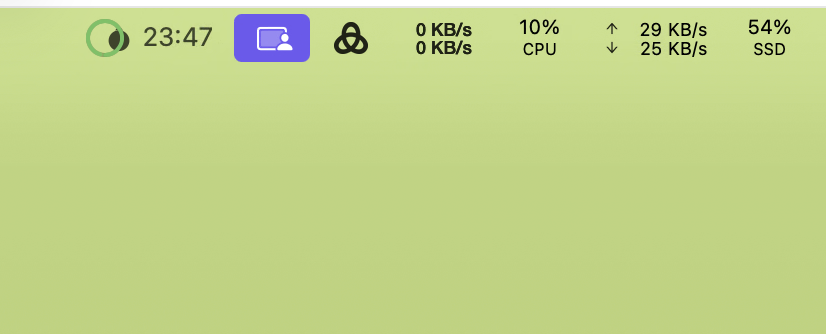

# PomodoroAuto

macOS 菜单栏番茄钟应用：自动识别前台应用并自动开始/暂停计时，让专注更自然。

## 功能亮点

- 自动开始/暂停：根据前台应用状态自动触发计时
- 全屏规则：全屏应用可按规则视为工作/非工作
- 今日统计：工作时长与番茄数一目了然
- 菜单栏快捷控制：轻量、不打扰

## 使用截图



## 快速开始

### 方式一：一键构建并安装（推荐）

```bash
./install.sh
```

### 方式二：直接运行（本地体验）

```bash
./run.sh
```

### 方式三：手动构建与运行

```bash
swift build
.build/debug/PomodoroAuto
```

## 首次使用（必做）

### 1) 授权辅助功能权限

首次启动时，应用会请求辅助功能权限（用于检测前台应用，无需屏幕录制权限）。

- **macOS 12+**：系统设置 → 隐私与安全性 → 辅助功能 → 点击“✕”移除旧授权 → 重新打开应用 → 点击“打开”

### 2) 基础设置

点击菜单栏图标 → Settings

- Work minutes：工作时长（默认 25 分钟）
- Break minutes：休息时长（默认 5 分钟）
- Auto start/pause：自动开始/暂停
- Auto-start allowlist：允许自动计时的应用白名单
  - 手动输入 bundle ID（如 `com.apple.Xcode`）
  - 或点击 “Choose...” 选择应用
- Fullscreen non-work / Fullscreen work allowlist：全屏判定规则

### 3) 查看统计

点击菜单栏图标 → Stats

- 今日累计工作时长
- 今日完成番茄数量

## 使用说明

### 快捷键

- `Space`：开始/暂停
- `R`：重置
- `S`：打开统计
- `,`：打开设置
- `Q`：退出

### 规则说明

1. Safari 全屏始终视为非工作状态
2. 自动开始白名单：仅在白名单中的应用才会自动触发计时
3. 全屏白名单：即使全屏也视为工作的应用

## 开发与构建

```bash
# Debug 构建
swift build

# Release 构建
swift build --configuration release

# 运行测试
swift test

# 清理构建
swift package clean
```

## 系统要求

- macOS 12.0+
- Xcode 15+（含 Swift 工具链）

## 数据存储

- 配置和统计数据存储在 UserDefaults
- 缓存最多保留 1000 条或 24 小时
